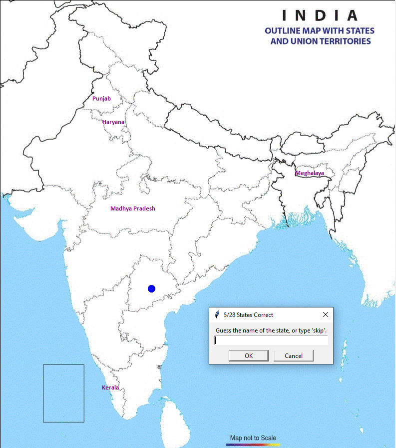

# Guess-Indian-States
 A game where you try to recall all 28 states of india. 

# To add custom map:

1. In 'screen_handler.py' change the existing gif to the gif of your map. Set height and width according to the file supplied and save your file.
2. Run 'location_mapper.py' and follow the console prompts. Click in the center of the place where you want your final game to place the text.
3. After you are done mapping the states, look for 'mapped_dictionary.txt' in the script folder. Open the file and copy it's last line.
4. Open 'main.py' and paste the contents replacing that of 'MAP_DATA_DICT'.
5. Run the file, Enjoy!
